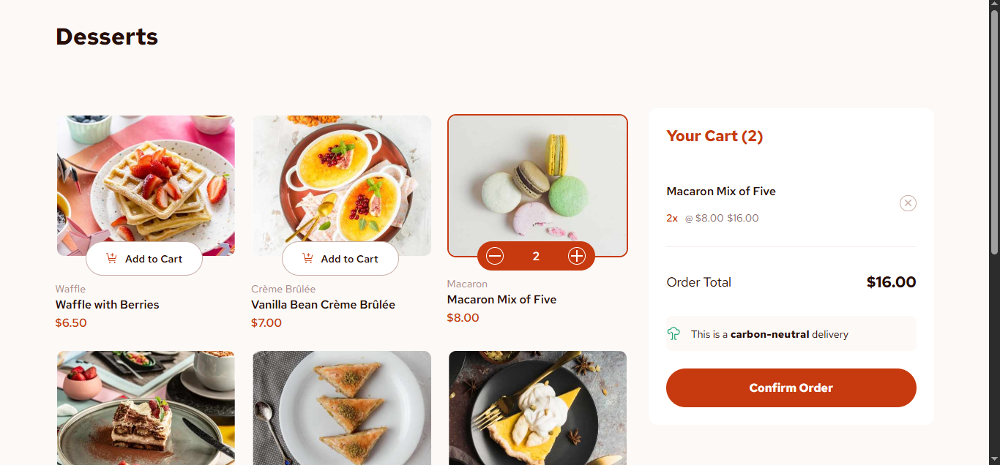

# Frontend Mentor - Product List with Cart Solution

This is my solution to the [Product List with Cart challenge on Frontend Mentor](https://www.frontendmentor.io/challenges/product-list-with-cart-5MmqLVAp_d).

## Table of contents

- [Overview](#overview)
  - [The challenge](#the-challenge)
  - [Screenshot](#screenshot)
  - [Links](#links)
- [My process](#my-process)
  - [Built with](#built-with)
  - [What I learned](#what-i-learned)
  - [Continued development](#continued-development)
  - [AI Collaboration](#ai-collaboration)
- [Author](#author)

## Overview

### The challenge

Users should be able to:

- Add items to the cart and remove them
- Increase/decrease the number of items in the cart
- See an order confirmation modal when they click "Confirm Order"
- Reset their selections when they click "Start New Order"
- View the optimal layout for the interface depending on their device's screen size
- See hover and focus states for all interactive elements on the page

### Screenshot




### Links

- Solution URL: [https://github.com/Bensolve/product-list-cart]
- Live Site URL: [https://product-list-cart-soln.netlify.app/]

## My process

### Built with

- Semantic HTML5 markup
- CSS custom properties (design tokens for colors)
- Flexbox
- CSS Grid
- Mobile-first workflow
- [React](https://react.dev/) - JS library
- [Vite](https://vitejs.dev/) - build tool and dev server
- Component-based architecture (ProductCard, ProductList, Cart, OrderModal)
- Data-driven rendering from a local `products.json` file

### What I learned

This project was a step up from my previous React project (a static results summary component) because it involved real, shared application state — the cart. The main thing I learned was how to "lift state up": the cart array lives in the top-level `App` component, and every function that changes it (add, increase, decrease, remove, confirm order, start new order) is defined there and passed down as props to whichever component needs it.

```jsx
function addToCart(product) {
  setCart([...cart, { ...product, quantity: 1 }]);
}
```

I also learned to derive values instead of storing them separately — the cart count and cart total aren't their own pieces of state, they're calculated fresh from the cart array on every render using `.reduce()`:

```jsx
const cartTotal = cart.reduce(
  (total, item) => total + item.price * item.quantity,
  0
);
```

On the CSS side, I ran into an interesting bug where I was using `height: 52%` on product images to get a specific crop, but the percentage was being calculated against an unpredictable stretched grid-row height (since CSS Grid stretches items to match the tallest row by default). Switching to a fixed height fixed the inconsistency across cards with different amounts of text.

I also practiced using semantic `aria-label`s on icon-only buttons (the quantity stepper's +/− and the cart's remove button), since there are multiple identical-looking icon buttons on the page and screen reader users need to know which specific product each one refers to.

### Continued development

- Get more comfortable choosing between `aspect-ratio` and fixed heights for responsive images depending on the situation
- Practice building components that need to work well both as a sidebar (desktop) and a stacked full-width section (mobile) without duplicating markup
- Learn more about focus trapping inside modals for full keyboard-only navigation

### AI Collaboration

I used Claude (Anthropic) as a learning aid throughout this project, not to generate the app end-to-end.

- **What I used it for**: planning the component breakdown and state shape before writing code, debugging real errors (an "Invalid hook call" caused by a stale dev server, a parsing error from a misplaced duplicate function signature, an ESLint scope error from a button pasted outside its `.map()`), and working through CSS layout issues like Grid's default item-stretching behavior affecting a percentage-based image height.
- **How it worked well**: walking through errors line-by-line helped me understand *why* something broke, not just get a fix — for example understanding that CSS grid-gap is named after what it separates (rows/columns) rather than the visual direction of the gap itself.
- **What I did myself**: wrote and adjusted all the CSS by hand, decided on the final visual details (spacing, color application, image cropping), and made the calls on component structure and file organization.

## Author

- Frontend Mentor - [@yourusername](https://www.frontendmentor.io/profile/Bensolve)
- GitHub - [(https://github.com/Bensolve)]